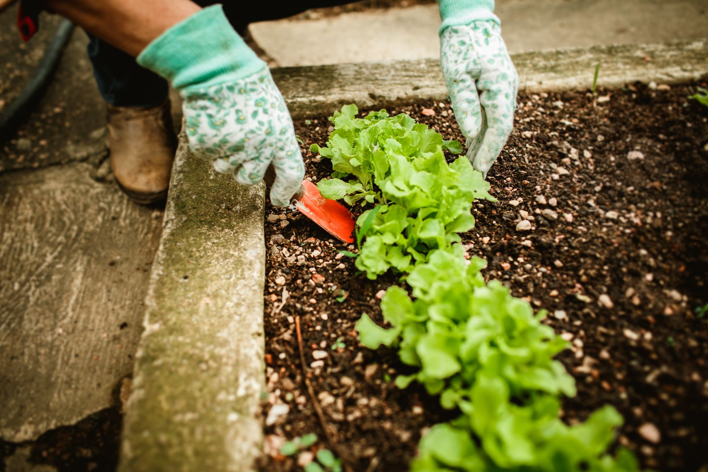

Most vegetable gardens go quiet in October because the gardener decided they were done, not because the season was. Lettuce, spinach, arugula and a handful of other greens actually prefer the cooler, shorter days of fall to the heat of midsummer — they're slower to bolt, less bothered by the pests that peak in July, and often sweeter once nights turn cold. The gardeners who keep harvesting into November and beyond aren't growing anything exotic; they're just planting the same greens on a staggered schedule instead of one big spring sowing that's finished by August.

**Quick answer:** For a fall harvest that keeps producing instead of running out all at once, sow a small batch of fast-maturing greens — loose-leaf lettuce, spinach, arugula, mizuna — every 10 to 14 days, working backward from your average first frost date so the last sowing still has time to reach a pickable size (check seed packets for days-to-maturity, then add a week for fall's shorter daylight). Favor loose-leaf and cut-and-come-again types over head lettuce, since you can harvest the outer leaves repeatedly rather than pulling the whole plant at once. Once hard frost threatens, a cold frame, low tunnel, or even a layer of frost cloth over hoops can keep many of these crops going weeks longer than an unprotected bed.

## Why Fall Greens Outperform a Spring Planting

Lettuce and most leafy greens bolt — send up a flower stalk and turn bitter — in response to long days and heat, which is exactly what a spring crop runs into by early summer. Fall reverses both triggers: daylight is shortening instead of lengthening, and soil and air temperatures are dropping instead of climbing. The same lettuce that turned bitter in July can stay sweet and tender for weeks in October because it never gets the signal to bolt.

Cold also does something useful to flavor. Many greens, spinach especially, convert stored starches to sugars as a natural antifreeze response once nights dip into the 30s and 40s (°F), which is why fall and overwintered spinach often tastes noticeably sweeter than a summer crop. Pest pressure drops too — aphids, flea beetles and cabbage worms are far less active once temperatures fall, so you'll likely spend less time managing damage than you would in a June planting.

The tradeoff is growth speed: everything grows more slowly as daylight and warmth decline, which is exactly why timing and succession matter more here than in spring.

## Which Greens to Plant Now (and Which to Skip)

Not every leafy crop is worth sowing this late. Pick based on how fast it matures and how much cold it tolerates, not just what you'd like to eat.

| Crop | Days to maturity (baby leaf) | Frost tolerance | Best for |
|---|---|---|---|
| **Loose-leaf lettuce** (e.g., oakleaf, salad bowl types) | 25-30 | Light frost (down to ~28°F) | Cut-and-come-again harvest, fastest payoff |
| **Spinach** | 30-40 | Hard frost (down to ~20°F with cover) | Sweetest flavor after cold, good for overwintering |
| **Arugula** | 20-25 | Light to moderate frost | Fastest crop on this list, peppery flavor improves in cool weather |
| **Mizuna and other mustard greens** | 25-35 | Moderate frost | Quick growth, mild heat from the mustard family |
| **Kale** | 50-60 (baby leaf sooner) | Very frost-hardy, improves after frost | Long-season crop if you started it in late summer, not a good new fall sowing |
| **Head lettuce (romaine, butterhead)** | 55-70 | Light frost only | Only worth starting now in mild-winter climates with a long fall |
| **Radishes** (not a green, but fits the same schedule) | 25-30 | Light frost | Fast filler crop between lettuce sowings |

If you're starting from seed rather than nursery starts, our guide to [starting seeds indoors](/blog/how-to-start-seeds-indoors/) covers the light and watering setup that prevents the leggy, stretched seedlings that struggle once transplanted outside — the same principles apply whether you're starting a fall or spring crop.

As a rule of thumb: the closer you are to your average first frost date, the more you should favor the fast, frost-tolerant crops at the top of that table (lettuce, arugula, spinach) over anything that needs 50+ days to size up.

## How to Build a Succession Planting Schedule

Succession planting just means sowing small amounts repeatedly instead of one large batch — the goal is a steady trickle of harvest-ready greens instead of a glut followed by nothing.

1. **Find your average first frost date** for your area (a county extension office or a frost-date lookup by ZIP code will have this). This is your backstop, not a hard deadline — many of these crops tolerate a light frost or two past that date, especially under cover.
2. **Check the days-to-maturity for each crop** you want to grow, and add 7-10 days to account for fall's shorter daylight hours slowing growth compared to the same crop in spring.
3. **Count backward from your frost date** to find your last safe sowing date for each crop. If arugula takes 25 days and you're adding a 10-day fall buffer, that's 35 days — don't sow it later than 35 days before your frost date unless you plan to protect it.
4. **Sow a small new batch every 10 to 14 days** up until each crop's last safe date, in whatever bed space you have free — a few feet of row or a couple of containers is enough per round.
5. **Stagger crops as well as sowing dates.** Mixing arugula, lettuce and spinach sowings spreads your harvest across different maturity windows instead of everything peaking the same week.
6. **Keep records of what you planted when.** A simple note in a phone app or garden journal of each sowing date saves you from guessing later whether a bed is ready to harvest or needs another week.

This staggered approach is also a good use of any bed space freed up as you clear out spent summer crops — working some finished compost into that soil before resowing gives the new greens a stronger start; see our guide to [composting at home](/blog/how-to-compost-at-home/) if you're not already turning garden waste into usable compost.

## Direct Sowing vs. Transplanting: Which Should You Use

Both work for fall greens, and the right choice depends mostly on how much time you have left before frost.

- **Direct sow when** you have 4+ weeks before your target harvest and want the simplest, lowest-effort option. Seeds go straight into prepared soil, thinned once they germinate. This is the default for arugula, spinach and loose-leaf lettuce, which transplant poorly if their taproot is disturbed too young.
- **Transplant nursery or home-started seedlings when** you're running close to your frost cutoff and need a head start of 2-3 weeks, or when you want tighter control over spacing in a small bed. Transplants also establish faster in cooling soil than direct-sown seed, which can germinate unevenly once temperatures drop.
- **Use a mix of both** if you're succession planting: direct-sow your early-fall rounds while the soil is still warm enough for reliable germination, then switch to transplants for your last one or two rounds as the season runs out.

Whichever method you use, water newly sown or transplanted greens consistently for the first week — fall rain can be unpredictable, and seedlings establishing in cooling soil don't forgive a dry spell the way an established plant does.

## Protecting Your Greens as It Gets Colder

A little protection buys real extra weeks of harvest, and none of it needs to be complicated.

- **Floating row cover** draped loosely over hoops traps a few degrees of warmth and blocks frost from settling directly on leaves, which is often what causes damage more than the cold air itself. Leave slack in the fabric so it doesn't press against the foliage.
- **A cold frame** extends the season further still by trapping daytime heat under a clear lid, and works well for an entire bed of fall greens rather than just a row. If you don't already have one, our guide to [building a DIY cold frame](/blog/diy-cold-frame-for-fall-winter-gardening/) walks through a simple version sized for exactly this kind of planting.
- **Mulch around the base of plants** (straw or shredded leaves) insulates roots and moderates soil temperature swings, even for crops left otherwise uncovered.

One caution worth flagging: any clear cover — a cold frame lid, a cloche, plastic sheeting — can overheat fast on a sunny fall day even when the air outside is cold, since the enclosed space traps solar heat. Vent or prop open covers on bright days above roughly 50°F, or you risk cooking the very plants you're trying to protect.

## Common Mistakes With Fall Greens

| Mistake | Why it backfires | Better approach |
|---|---|---|
| Sowing everything in one big fall planting | Creates a glut followed by a gap, instead of steady harvest | Stagger sowings every 10-14 days until the last safe date |
| Choosing slow crops (head lettuce, kale from seed) too close to frost | They won't size up before growth stalls in low light | Stick to fast, frost-tolerant crops in your final sowings |
| Harvesting whole plants instead of outer leaves | Ends that plant's production instead of extending it | Pick outer leaves cut-and-come-again style and let the center keep growing |
| Leaving row cover sealed tight on warm, sunny days | Traps heat and can scorch or wilt plants underneath | Vent or prop open covers whenever daytime temps climb |
| Skipping water because "it's cooler now" | Cooling soil still dries out, and seedlings are shallow-rooted | Water consistently, especially in the first week after sowing |
| Ignoring soil prep between summer and fall crops | Depleted soil slows fall greens just when daylight is already limited | Work in compost or finished soil amendments before resowing |

## FAQ

### How late in fall can I still start lettuce or greens?

It depends on the crop and your frost date, but as a rough guide, stop sowing fast arugula or loose-leaf lettuce about 3-4 weeks before your average first frost if the bed is uncovered, or up to 6-8 weeks before if you'll be using a cold frame or row cover. Past that, growth slows too much in low light to be worth the bed space.

### Do I need to test or amend my soil before a fall planting?

It's worth checking if you haven't tested in a while, especially in a bed that just finished a heavy summer crop like tomatoes. Our guide to [testing soil pH](/blog/how-to-test-soil-ph/) covers how to sample and what to adjust, though for a quick fall sowing, working in some finished compost is often enough to refresh depleted soil without a full pH correction.

### Will my greens survive the first frost, or do I need to harvest everything before then?

Most of the crops on this list tolerate a light frost (28-32°F) without damage, and some, like spinach and kale, actually improve in flavor afterward. It's a hard freeze, not the first light frost, that typically ends an unprotected planting — if a hard freeze is forecast and your crop isn't covered, harvest what's ready rather than risk losing it.

### Can I succession plant in containers instead of a garden bed?

Yes, and it's often easier to manage, since you can move containers to a more sheltered spot as it gets colder or bring them in briefly during a surprise frost. Use a container at least 6-8 inches deep for shallow-rooted greens like lettuce and arugula, and water more frequently than you would a bed, since containers dry out faster.
