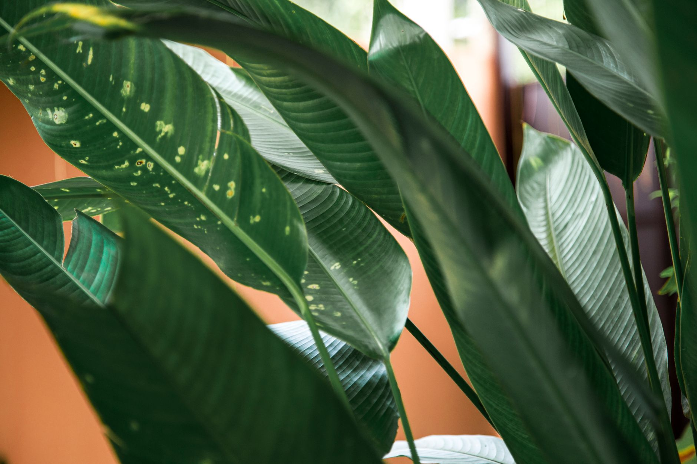

If you moved houseplants outside for the summer, don't wait for the first cold snap to bring them back in. By the time you feel it, they've already been stressed — and possibly stowed away a few hitchhikers you don't want in your living room.

## Watch the Nighttime Temperature, Not the Calendar

The trigger isn't a date, it's nighttime lows. Most tropical houseplants start struggling once temperatures consistently drop below 55°F (13°C), and some — like fiddle leaf figs and calatheas — show damage even earlier. A single cold night usually won't kill anything, but repeated nights in the low 50s will show up as yellowing, dropped leaves, or slowed growth within a couple of weeks.

Check your local overnight forecast, not just the daytime high. Early fall days can still hit 75°F while nights quietly slide into the 40s.

## Use the 50-50 Rule

A simple way to time it: bring plants in when nighttime temperatures are consistently in the 50s, roughly 50 days before your area's average first frost date. That buffer gives you time to move plants gradually instead of all at once, and it avoids the scramble of doing it the night a frost warning shows up.

If you don't know your average first frost date, a quick search for your city name plus "first frost date" will give you a solid estimate.

## Inspect Every Plant Before It Comes Inside

This is the step people skip, and it's the one that matters most. Plants that spent the summer outside often bring pests inside with them — aphids, spider mites, and mealybugs are the usual culprits, and they spread fast once they're indoors with no natural predators to keep them in check.

Before moving anything inside:

- Check the undersides of leaves, not just the tops — that's where mites and mealybugs tend to hide.
- Look for sticky residue on leaves or nearby surfaces, a sign of aphids or scale.
- Inspect the soil surface for ants or gnats, and check drainage holes for anything that's moved in.
- If you spot pests, treat with insecticidal soap and isolate the plant for a week or two before it joins the rest of your collection — don't bring it straight into a room with your other plants.

## Clean Pots and Refresh the Soil Surface

While you're inspecting each plant, take the opportunity to wipe down the outside of the pot and clean off any debris, moss, or algae buildup that accumulated outdoors over the summer — this isn't just cosmetic, since debris on a pot's surface can also harbor pests or fungal spores. If the top layer of soil looks compacted, crusted, or has visible mineral buildup from outdoor watering, scraping off the top half-inch and replacing it with fresh potting mix gives the plant a cleaner start indoors without the disruption of a full repot. This is also a natural moment to check whether a plant has become root-bound over the summer's outdoor growing season, since outdoor conditions often accelerate growth compared to an indoor spot.

## Adjust for Lower Indoor Humidity

Outdoor air, especially in humid climates or near other plants and landscaping, is often more humid than the average indoor room, particularly once heating systems kick on later in fall. Plants that thrived outdoors may show crispy leaf edges or increased leaf drop as they adjust to drier indoor air. Grouping humidity-loving plants together, using a pebble tray with water beneath the pots, or running a small humidifier nearby can ease this transition, especially for plants like calatheas or ferns that are more sensitive to humidity swings than tougher species.

## Let Plants Adjust to Lower Light First

Even a bright indoor spot gets a fraction of the light plants had outside. Moving a plant straight from full sun to a dim corner shocks it, often causing sudden leaf drop. A week or two before the final move, shift plants to a shadier spot outdoors — under a tree or on a covered porch — so they start adjusting before the light change gets more dramatic indoors.

## Skip Fertilizer for a Few Weeks

Hold off on fertilizing right after the move. Plants are already dealing with lower light and a new environment, and fresh fertilizer salts in a stressed root system can do more harm than good. Resume a normal feeding schedule once you see new growth, usually a few weeks after the plant has settled in.

## Group Plants by Light Needs, Not Just Available Space

It's tempting to line every pot up on the nearest windowsill, but a plant that thrived in full outdoor sun still needs your brightest indoor spot, while shade-tolerant plants can go further from the window. Sorting by light requirement first — then fitting them into your space — keeps plants from going into a slow decline that's hard to diagnose weeks later.
