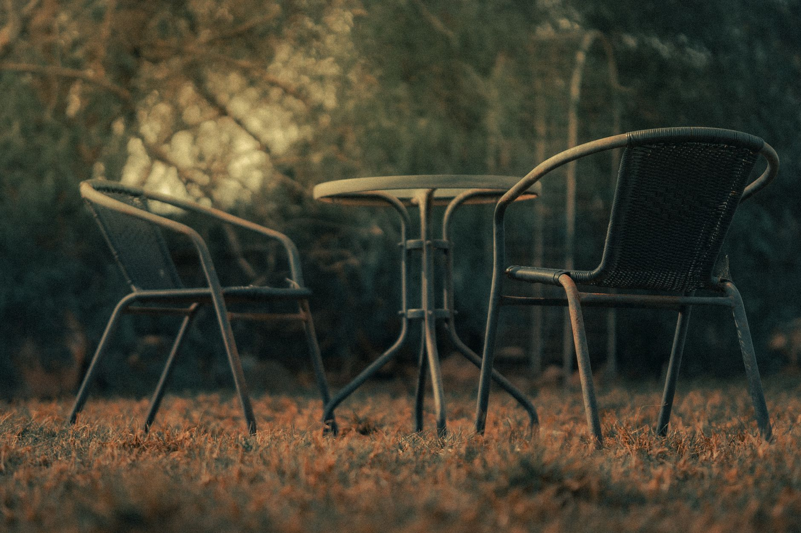

A little end-of-season prep saves you from replacing rusted, cracked, or mildewed patio furniture every few years. Here's a simple checklist before temperatures drop.

## Step 1: Clean Everything First

Dirt and organic debris left on furniture over winter traps moisture against the surface, accelerating rust on metal and mildew on fabric. Wipe down frames and hose off cushions before storing anything.

## Step 2: Sort by Material

- **Wood**: clean, let fully dry, then apply a protective sealant or oil if it's uncoated. Store under cover if possible.
- **Metal (steel, wrought iron)**: check for rust spots and treat them before winter — moisture trapped under a rust spot all season makes it much worse by spring.
- **Wicker/rattan (natural)**: bring indoors or into a shed if at all possible; natural fiber wicker is the most vulnerable to cracking in freeze-thaw cycles.
- **Resin/plastic**: the most weather-tolerant option, but still benefits from a cover to prevent UV fading over winter.

## Step 3: Store or Cover Cushions

Fabric cushions should come inside if you have the storage space — even "weather-resistant" fabric breaks down faster with repeated freeze-thaw cycles and moisture exposure. If indoor storage isn't an option, use a waterproof storage bin or heavy-duty cover.

## Step 4: Cover What Stays Outside

For furniture that stays on the patio, use a fitted, waterproof cover rather than a generic tarp — a proper cover allows some airflow underneath, which prevents the mildew that builds up under a fully sealed tarp trapping condensation.

## Step 5: Don't Forget the Grill

Clean grease and food debris from the grates and interior, disconnect and store propane tanks separately (never indoors), and use a grill-specific cover to prevent rust on the exterior.

## Step 6: Check Drainage on Planters

Empty and clean any planters that won't overwinter with plants in them — soil left in a pot can freeze, expand, and crack ceramic or terracotta containers.
